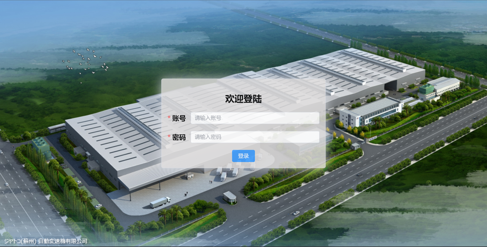
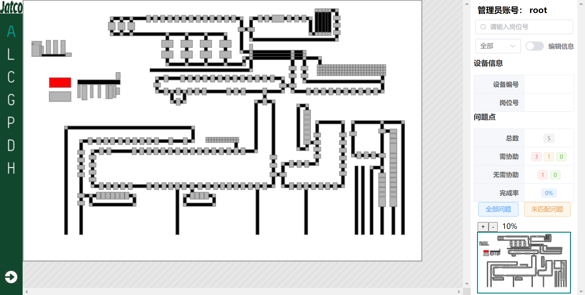
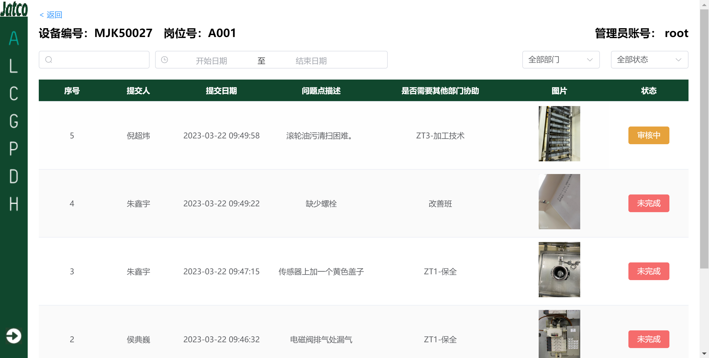

# plant-layout
> 厂房设备平面可视化系统  

项目使用 node.js + vue，具体介绍见[plant-layout介绍](plant-layout介绍.pdf)，vue 代码内容见[plant-layout-UI](https://github.com/xuyj1111/plant-layout-UI)

结构介绍：
- `dist`：为打包的`plant-layout-UI`项目
- `log`：`error.log`保存错误日志
- `metadata`：元数据文件夹
- `index.js`：入口文件
- `modules`：`router.js`使用 Express 接收请求
- `plant-layout.bat`：包装`plant-layout.exe`，输出错误信息到log
- `plant-layout.exe`：使用`pkg`将nodejs项目打包成exe文件

